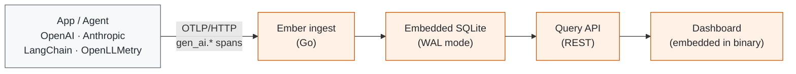

<div align="center">

# Ember

### LLM and agent observability that runs as one binary

Trace waterfalls, session grouping, and token/cost analytics for any app that speaks
OpenTelemetry — self-hosted, with an embedded SQLite database instead of a
ClickHouse/Postgres/Redis stack.

[](https://github.com/sakshamgoswami/ember/actions/workflows/ci.yml)
[](https://github.com/sakshamgoswami/ember/actions/workflows/release.yml)
[](LICENSE)
[](go.mod)
[](https://github.com/sakshamgoswami/ember/pkgs/container/ember)

[Quickstart](#quickstart) · [Connect your app](#connect-your-app) · [How it works](#how-it-works) · [Configuration](#configuration) · [Integrations guide](docs/INTEGRATIONS.md)

</div>

---

## Quickstart

```bash
git clone https://github.com/sakshamgoswami/ember.git
cd ember
cp .env.example .env          # set EMBER_API_KEY to any string of 16+ characters
docker compose up -d --build
```

That's the whole install. Open **http://localhost:8080**.

<details>
<summary><b>Prefer the published image?</b> (no build step)</summary>

<br>

```bash
docker run -p 8080:8080 -v ember-data:/data \
  -e EMBER_API_KEY=ember_your_key_here \
  ghcr.io/sakshamgoswami/ember:latest
```

Available once a `v*` tag is pushed — the release workflow publishes
multi-arch images for `linux/amd64` and `linux/arm64`.

</details>

<details>
<summary><b>Prefer to build from source?</b> (Go 1.26+ and Node 22+)</summary>

<br>

```bash
make build     # builds the dashboard, then embeds it into the Go binary
make run       # starts ember on :8080
```

</details>

**No traces yet?** Send some sample ones:

```bash
EMBER_API_KEY=<your key> make demo          # Go
EMBER_API_KEY=<your key> make demo-python   # Python
```

> [!NOTE]
> The demo agents are plain OpenTelemetry programs with **fabricated** token
> counts. They call no LLM and cost nothing — they exist so a fresh install
> has something to render, and they double as instrumentation examples.

---

## Connect your app

Ember is a **passive receiver**. It never reaches into your app or calls your
provider — your app pushes spans to it. Anything already emitting the
OpenTelemetry [`gen_ai.*` conventions](https://opentelemetry.io/docs/specs/semconv/gen-ai/)
works with **no Ember-specific SDK**.

The entire contract is two values:

| | |
|:--|:--|
| **Endpoint** | `http://<ember-host>:8080/v1/traces` |
| **Auth** | `Authorization: Bearer <your EMBER_API_KEY>` |

<details open>
<summary><b>Zero code — environment variables only</b></summary>

<br>

If your app already initializes an OpenTelemetry SDK, you don't need to touch
the code:

```bash
export OTEL_EXPORTER_OTLP_TRACES_ENDPOINT=http://localhost:8080/v1/traces
export OTEL_EXPORTER_OTLP_TRACES_HEADERS="Authorization=Bearer%20ember_your_key"
export OTEL_SERVICE_NAME=my-agent
```

> [!IMPORTANT]
> The `%20` matters. `OTEL_*_HEADERS` is a URL-encoded list, so the space
> after `Bearer` must be written `%20`. A literal space is the single most
> common reason traces silently fail to arrive.

</details>

<details>
<summary><b>Auto-instrumentation — spans for your provider calls, no span code</b></summary>

<br>

Add a GenAI auto-instrumentation package. Both of these cover OpenAI,
Anthropic, LangChain, and LlamaIndex:

- **OpenLLMetry** (`traceloop-sdk`) — set `TRACELOOP_BASE_URL=http://localhost:8080`
  and `TRACELOOP_HEADERS="Authorization=Bearer%20<key>"`. It appends
  `/v1/traces` itself, so pass the base URL.
- **OpenInference** (`openinference-instrumentation-*`) — instrument your
  client, then export with the standard OTLP variables above.

Python's fully zero-code path:

```bash
pip install opentelemetry-distro opentelemetry-exporter-otlp
opentelemetry-bootstrap -a install
opentelemetry-instrument python my_agent.py
```

</details>

<details>
<summary><b>Manual spans — full control</b></summary>

<br>

```python
with tracer.start_as_current_span("agent.run", attributes={"session.id": sid}) as root:
    with tracer.start_as_current_span("chat", attributes={
        "gen_ai.operation.name": "chat",
        "session.id": sid,
    }) as chat:
        response = client.messages.create(...)   # the call goes INSIDE the span
        chat.update_name(f"chat {model}")
        chat.set_attribute("gen_ai.system", "anthropic")
        chat.set_attribute("gen_ai.request.model", model)
        chat.set_attribute("gen_ai.usage.input_tokens", response.usage.input_tokens)
        chat.set_attribute("gen_ai.usage.output_tokens", response.usage.output_tokens)
```

Runnable examples: [`examples/python-agent`](examples/python-agent) ·
[`examples/demo-agent`](examples/demo-agent) (Go)

</details>

### What Ember reads off your spans

Everything is optional — a span with none of these still appears — but each
one lights up part of the UI.

| Attribute | What it powers |
|:--|:--|
| `gen_ai.request.model` / `gen_ai.response.model` | Model column, per-model analytics |
| `gen_ai.usage.input_tokens` / `output_tokens` | Token counts and cost |
| `gen_ai.system` | Provider label (`openai`, `anthropic`, …) |
| `gen_ai.operation.name` | Distinguishes `chat` from `execute_tool` |
| `session.id` or `gen_ai.conversation.id` | Groups traces into a conversation |
| `gen_ai.tool.name` | Names the tool on tool spans |

Legacy names (`prompt_tokens`, `completion_tokens`) are accepted too, so older
instrumentation works unchanged.

👉 **[Full integration guide](docs/INTEGRATIONS.md)** — container networking,
multi-project setup, and troubleshooting.

---

## Why this exists

Every open-source LLM observability tool asks for more infrastructure than a
solo developer or small team wants to run:

| Tool | Self-host shape | 2026 status |
|:--|:--|:--|
| Langfuse | 6 services: web, worker, Postgres, ClickHouse, Redis, S3 | Active; maintainers call the stack "a burden" for small teams |
| Helicone | Proxy gateway + Postgres | Maintenance mode since its March 2026 acquisition |
| Arize Phoenix | Single Python service, Elastic License 2.0 | Active; built around evals rather than tracing UX |
| **Ember** | **1 Go binary, embedded SQLite** | New |

Ember is OpenTelemetry-native from the ground up, so you are never locked into
a vendor's bespoke SDK. See [`docs/PRD.md`](docs/PRD.md) for the full product
reasoning and roadmap.

---

## How it works



One process, one port, one file on disk.

| Component | Path | Role |
|:--|:--|:--|
| **Ingestion** | `internal/ingest` | OTLP/HTTP receiver (protobuf + JSON) at `POST /v1/traces`; extracts `gen_ai.*` attributes and merges resource + span attributes |
| **Storage** | `internal/storage` | One SQLite database. Trace/session rollups are recomputed from the full span set on write, since a trace's spans often arrive across several export batches |
| **Pricing** | `internal/pricing` | Built-in USD/1M-token rate table, overridable via `EMBER_PRICING_PATH` |
| **API** | `internal/api` | Read-only REST: `/api/traces`, `/api/traces/{id}`, `/api/sessions`, `/api/analytics/usage` |
| **Dashboard** | `web/` | React + TypeScript SPA, built once and embedded via `go:embed` — no separate frontend server |

`GET /healthz` is unauthenticated and returns `{"status":"ok"}`. The compose
healthcheck reaches it through `ember -healthcheck`, since the distroless
runtime image has no shell or curl.

---

## Configuration

| Variable | Default | Meaning |
|:--|:--|:--|
| `EMBER_API_KEY` | _(unset)_ | Ingest key. Set it up front (compose reads it from `.env`) instead of scraping the first-run log. Changing it re-keys the project on the next container recreation |
| `EMBER_ADDR` | `:8080` | Address the single HTTP server listens on |
| `EMBER_DB_PATH` | `ember.db` | Path to the SQLite database file |
| `EMBER_PRICING_PATH` | _(unset)_ | Optional JSON file of model pricing overrides |

**Flags**

| Flag | Purpose |
|:--|:--|
| `ember -rotate-key` | Issues a new API key, keeping every stored trace |
| `ember -healthcheck` | Probes a running instance; used by the container healthcheck |

If you didn't set `EMBER_API_KEY`, the first run generates a key and prints it
once:

```
=========================================================
 Ember generated an API key for the 'default' project.
 It's stored as a hash — this is the only time it's shown.
 Lost it? Run 'ember -rotate-key' to issue a new one.

   ember_xxxxxxxxxxxxxxxxxxxxxxxxxxxxxxxxxxxxxxxxxxxxxxxx
=========================================================
```

It's stored only as a hash and can't be shown again — but a lost key no longer
costs you your data. `make rotate-key` issues a new one in place.

### Common commands

| Command | Does |
|:--|:--|
| `make up` | Start the compose stack (creates `.env` if missing) |
| `make down` | Stop it, keeping the data volume |
| `make logs` | Follow the logs |
| `make rotate-key` | Issue a new API key |
| `make test` · `make lint` | `go test ./...` · `go vet` + `tsc --noEmit` |

---

## Development

Hot-reload, two terminals:

```bash
cd web && npm install && npm run dev     # dashboard on :5173, proxies /api and /v1 to :8080
go run ./cmd/ember                       # backend on :8080
```

---

## Security

> [!WARNING]
> **v1 has no dashboard authentication and no RBAC.** The `/v1/traces`
> ingestion endpoint is gated by the API key, but `/api/*` and the dashboard
> are open to anyone who can reach the port — including prompt metadata.

This is a deliberate scope cut (see the non-goals in the PRD), not an
oversight. Keep Ember on localhost or a private network, or put it behind a
reverse proxy enforcing your own auth, before exposing it anywhere shared.

---

## Contributing

Issues labeled [`good first issue`](https://github.com/sakshamgoswami/ember/labels/good%20first%20issue)
are a good place to start. Please open an issue before a large PR so we can
agree on the approach first.

```bash
go test ./...
cd web && npx tsc --noEmit
```

See [`CONTRIBUTING.md`](CONTRIBUTING.md) for the full guide.

---

<div align="center">

**[MIT](LICENSE)** · Built with OpenTelemetry

</div>
