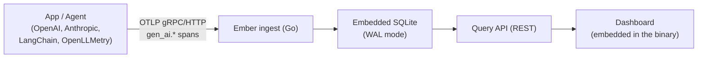

# Ember

**LLM and agent observability that runs as one binary.**

Ember receives OpenTelemetry GenAI traces from any instrumented app and gives
you a trace waterfall, session grouping, and cost/token analytics — self-hosted,
with an embedded SQLite database instead of a ClickHouse/Postgres/Redis stack.

```bash
git clone https://github.com/sakshamgoswami/ember.git
cd ember
cp .env.example .env          # set EMBER_API_KEY to anything 16+ characters
docker compose up -d --build
```

Open `http://localhost:8080`, point your app's OTel exporter at
`http://localhost:8080/v1/traces` with `Authorization: Bearer <your key>`,
and traces show up within seconds. See
[`docs/INTEGRATIONS.md`](docs/INTEGRATIONS.md) for how to wire up your app.

Once a release is tagged, the published image skips the build entirely:

```bash
docker run -p 8080:8080 -v ember-data:/data \
  -e EMBER_API_KEY=ember_your_key ghcr.io/sakshamgoswami/ember:latest
```

## Why this exists

Every open-source LLM observability tool asks for more infrastructure than a
solo developer or small team wants to run:

| Tool | Self-host shape | 2026 status |
|---|---|---|
| Langfuse | 6 services: web, worker, Postgres, ClickHouse, Redis, S3 | Active, maintainers call the stack "a burden" for small teams |
| Helicone | Proxy gateway + Postgres | Maintenance mode since its March 2026 acquisition |
| Arize Phoenix | Single Python service, Elastic License 2.0 | Active, built around evals rather than tracing UX |
| **Ember** | **1 Go binary, embedded SQLite** | New |

Ember is OpenTelemetry-native from the ground up — it speaks the
[`gen_ai.*` semantic conventions](https://opentelemetry.io/docs/specs/semconv/gen-ai/)
directly, so any app already emitting OTel traces (OpenAI, Anthropic,
LangChain, LlamaIndex, or a hand-rolled agent) needs zero Ember-specific SDK.

See [`docs/PRD.md`](docs/PRD.md) for the full product reasoning and roadmap.

## Quickstart from source

Requires Go 1.23+ and Node 20+.

```bash
git clone https://github.com/sakshamgoswami/ember.git
cd ember
make build     # builds the dashboard, then embeds it into the Go binary
make run       # starts ember on :8080
```

If you didn't set `EMBER_API_KEY`, the first run generates one and prints it:

```
=========================================================
 Ember generated an API key for the 'default' project.
   ember_xxxxxxxxxxxxxxxxxxxxxxxxxxxxxxxxxxxxxxxxxxxxxxxx

 Point an OTel exporter at this instance:
   OTEL_EXPORTER_OTLP_TRACES_ENDPOINT=http://localhost:8080/v1/traces
   OTEL_EXPORTER_OTLP_TRACES_HEADERS=Authorization=Bearer%20ember_xxxx...
=========================================================
```

It's stored as a hash, so it can't be shown again — but a lost key no longer
means losing your data. `make rotate-key` (or `ember -rotate-key`) issues a
new one and leaves every trace in place.

No traces yet? Run the bundled demo agent — it's a plain OpenTelemetry
program, nothing Ember-specific, so it doubles as a working instrumentation
example:

```bash
EMBER_API_KEY=<your key> make demo          # Go
EMBER_API_KEY=<your key> make demo-python   # Python
```

Both are plain OpenTelemetry programs with fabricated token counts — they
exist so a fresh install has something to render, and double as
instrumentation examples. They do not call any LLM.

### Hot-reload development

```bash
# terminal 1
cd web && npm install && npm run dev     # dashboard on :5173, proxies /api and /v1 to :8080

# terminal 2
go run ./cmd/ember                       # backend on :8080
```

## How it works



- **Ingestion** (`internal/ingest`) — an OTLP/HTTP receiver (protobuf and
  JSON) at `POST /v1/traces`. It extracts `gen_ai.*` attributes (model,
  system, token usage, tool calls) and merges resource + span attributes.
- **Storage** (`internal/storage`) — one SQLite database. Trace/session
  rollups are recomputed from the full span set on write, since a trace's
  spans often arrive across more than one export batch.
- **Pricing** (`internal/pricing`) — a built-in USD/1M-token rate table for
  common models, overridable via `EMBER_PRICING_PATH` (see
  `examples/demo-agent/pricing.example.json`).
- **API** (`internal/api`) — read-only REST endpoints the dashboard runs on:
  `GET /api/traces`, `GET /api/traces/{id}`, `GET /api/sessions`,
  `GET /api/analytics/usage`.
- **Dashboard** (`web/`) — a React + TypeScript SPA, built once and embedded
  into the Go binary via `go:embed`. There is no separate frontend server in
  production.

`GET /healthz` is unauthenticated and returns `{"status":"ok"}`; the compose
healthcheck uses it via `ember -healthcheck`, since the distroless runtime
image has no shell or curl.

**Connecting your own app** is covered in
[`docs/INTEGRATIONS.md`](docs/INTEGRATIONS.md) — environment-variable-only
setup, auto-instrumentation, the exact `gen_ai.*` attributes Ember reads, and
troubleshooting. Runnable examples: [`examples/python-agent`](examples/python-agent)
and [`examples/demo-agent`](examples/demo-agent).

## Configuration

| Variable | Default | Meaning |
|---|---|---|
| `EMBER_ADDR` | `:8080` | Address the single HTTP server listens on |
| `EMBER_DB_PATH` | `ember.db` | Path to the SQLite database file |
| `EMBER_PRICING_PATH` | _(unset)_ | Optional JSON file of model pricing overrides |
| `EMBER_API_KEY` | _(unset)_ | Ingest key. Set it up front (compose reads it from `.env`) instead of scraping the first-run log; changing it re-keys the project on restart |

Flags: `ember -rotate-key` issues a new API key without touching stored
traces; `ember -healthcheck` probes a running instance and is what the
container healthcheck uses.

## Security note (read this before exposing Ember beyond localhost)

v1 has no dashboard authentication and no RBAC — that's a deliberate scope
cut (see the non-goals in the PRD), not an oversight. The `/v1/traces`
ingestion endpoint is gated by the per-project API key, but `/api/*` and the
dashboard are open to anyone who can reach the port. Put Ember behind a
reverse proxy with your own auth (or keep it on a private network / VPN) if
it's reachable from anywhere but your own machine.

## Contributing

Issues labeled [`good first issue`](https://github.com/sakshamgoswami/ember/labels/good%20first%20issue)
are a good place to start. Please open an issue before a large PR so we can
agree on approach first.

```bash
go test ./...
cd web && npx tsc --noEmit
```

## License

[MIT](LICENSE)
