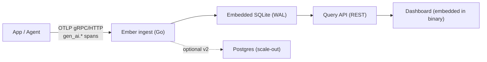

# Ember — Product Requirements Document

Status: Draft v0.1 · 2026-09-13

## 1. Problem & opportunity

Teams shipping LLM apps and agents need to see inside them — which prompt
ran, which tool call it made, how many tokens it burned, why it hung. Two
independent developer signals point at a real gap here: a 2025 CHI paper on
multi-agent debugging found developers lose track of agent behavior once a
task produces 50–100+ exchanged messages, with no interactive way to step
through what happened; Stack Overflow's 2025 survey (49,000+ respondents)
found 45% of developers say debugging AI-generated code takes longer than
debugging code they wrote themselves.

The tools built to fill this gap have drifted away from the developers who
need them most:

- **Langfuse** (31.7k GitHub stars, MIT core) moved its self-hosted v3
  architecture to six coordinated services — web, worker, Postgres,
  ClickHouse, Redis, S3. Its own maintainers call that "a burden" for a
  small team or personal project.
- **Helicone** was acquired by Mintlify in March 2026 and moved to
  maintenance mode: security patches only, no new features.
- **LangSmith** is cloud-only, tied to the LangChain ecosystem.
- **Arize Phoenix** is genuinely self-hostable and OpenTelemetry-native, but
  built around evaluation/experimentation first, ships under the Elastic
  License 2.0, and runs as a Python service rather than a single artifact.

**The opening:** no open-source LLM observability tool today lets a
developer point one Docker command at it, get a trace waterfall in under a
minute, and never touch ClickHouse.

## 2. Market research

- LLM observability platform market: **$2.69B in 2026**, growing from
  $1.97B in 2025 (36.3% CAGR), projected to reach **$9.26B by 2030**.
- Gartner: LLM observability investment will be present in 50% of GenAI
  deployments by 2028, up from 15% in early 2026.
- OpenTelemetry's GenAI Special Interest Group has been standardizing
  `gen_ai.*` trace semantic conventions since April 2024. Core attributes
  have been stable in shape since v1.37.0; auto-instrumentation already
  exists for OpenAI, Anthropic, LangChain, and LlamaIndex. The spec is
  still pre-1.0 and can change, but building on it removes the biggest
  reason teams get locked into an incumbent's bespoke SDK.

| Tool | License | Self-host shape | 2026 status | Best fit |
|---|---|---|---|---|
| Langfuse | MIT (core) | 6 services (web, worker, Postgres, ClickHouse, Redis, S3) | Active, acquired by ClickHouse Jan 2026 | Teams already running that infra, $30K–$200K/mo LLM spend |
| Helicone | Apache 2.0 | Proxy gateway + Postgres | Maintenance mode (Mintlify acquisition, Mar 2026) | Existing users, not new production bets |
| LangSmith | Proprietary | SaaS only | Active | Deep LangGraph users, >$200K/mo spend |
| Arize Phoenix | Elastic License 2.0 | Single Python service | Active | Eval/experiment-tracking priority |
| **Ember** | MIT | 1 Go binary, embedded SQLite | New | Solo devs, small teams, self-hosters priced out of ClickHouse |

## 3. Target users

1. **Indie agent builder** — 1–3 agents on a $5–20/mo VPS, currently
   grepping logs. Wants one command to a trace waterfall.
2. **Small eng team (2–15)** — outgrew print statements, can't justify a
   6-container stack or enterprise-scaled SaaS billing.
3. **Privacy/compliance-constrained team** — can't send prompts to
   third-party SaaS at all; needs full data ownership.
4. **OSS contributors** — looking for a well-scoped, actively maintained
   Go/TS project with clear good-first-issues.

## 4. Vision & positioning

*"The Uptime Kuma of LLM observability."* Uptime Kuma didn't out-feature
the incumbent uptime monitors — it out-simpled them.

> For developers who self-host, Ember is the LLM observability tool that
> runs as one binary and speaks OpenTelemetry natively — unlike Langfuse,
> which needs a five-service stack, and unlike Helicone, which is no longer
> actively developed.

## 5. Goals & non-goals

**Goals**
- `docker run` to a rendered trace in under 60 seconds on a $5 VPS.
- Accept traces from any OTel GenAI-compliant exporter, zero custom SDK.
- Answer "which call was slow / expensive / wrong" fast, per request or
  per session.
- MIT-licensed, contributor-friendly, single-repo Go + TypeScript.

**Explicit non-goals for v1**
- No evals/experimentation platform (Phoenix/Langfuse territory).
- No prompt management or versioning.
- No proxy/gateway mode — Ember only receives OTel data, never sits in the
  request path.
- No SSO/RBAC/enterprise auth.

## 6. Feature set

| Tier | Scope |
|---|---|
| **v1 · MVP** | OTLP/HTTP + gRPC ingestion (`gen_ai.*`), trace waterfall, session grouping, token/cost analytics, search & filter, multi-project API keys, single Docker image with embedded SQLite |
| **v2 · Retain** | Latency/error/cost alerting via webhook, thin native SDKs, saved/shareable trace views, pluggable Postgres backend |
| **v3 · Expand** | Lightweight eval scoring, prompt version diffing, optional hosted-cloud tier, team roles/SSO if enterprise demand appears |

## 7. Architecture

Data model (MVP): `Project`, `Trace`, `Span`, `Session` — see
[`internal/model/model.go`](../internal/model/model.go) for the authoritative
field list.

Stack: Go backend (OTLP receiver, SQLite via `modernc.org/sqlite`, REST
API), TypeScript + React dashboard built with Vite and embedded via
`go:embed`. Distribution: one static binary, one Docker image.

## 8. Success metrics

| Metric | 90 days | Year 1 |
|---|---|---|
| GitHub stars | 500 | 2,000 |
| External contributors | 3 | 10+ |
| Docker pulls / binary downloads | 1,000 | 15,000 |
| OTel exporters verified compatible | 4 | 8+ |
| Time from install to first trace | <60s | <60s, held |

Contributor count matters as much as stars — it's the metric that turns
this from a resume line into an actual track record.

## 9. Go-to-market

- Launch content: a factual "Langfuse vs Ember: when six containers is too
  many" comparison post.
- Engage the OpenTelemetry GenAI SIG directly — being a visible OTel-native
  reference implementation is worth more than ad spend here.
- Submit to `awesome-observability`, `awesome-selfhosted`, r/selfhosted,
  r/LocalLLaMA.
- Show HN once the 60-second install claim is true and demoable.
- Ship `CONTRIBUTING.md` and labeled good-first-issues before asking anyone
  to star it.

## 10. Risks & mitigations

| Risk | Likelihood | Mitigation |
|---|---|---|
| Langfuse ships a lightweight mode | Medium | Move now, while their v3 migration pain is fresh and public |
| OTel GenAI spec breaks compatibility | Medium (pre-1.0) | Isolate the OTel schema behind a thin adapter layer |
| Solo-maintainer bus factor | High by default | The §5 non-goals are what keeps an 8-week solo v1 shippable |
| SQLite doesn't hold at scale | Low for target users | Storage interface is pluggable; Postgres lands in v2 without a rewrite |

## 11. Roadmap

| When | Milestone |
|---|---|
| Weeks 1–2 | OTLP ingestion, SQLite schema, minimal query API |
| Weeks 3–4 | Dashboard skeleton, single Docker image with embedded frontend |
| Weeks 5–6 | Cost/token analytics, session grouping, search & filter |
| Weeks 7–8 | Docs, one-line install, compatibility testing, comparison post, Show HN |
| Post-launch | v2 planning — alerting, SDKs, Postgres backend, scoped by real user asks |

## 12. Licensing

MIT. Langfuse's growth engine was an unusually permissive self-host story —
no seat caps, no retention limits, full product under MIT. Given that
contributor count and adoption are the actual v1 success metrics, MIT is
the only license that doesn't work against them.

## Sources

- [Langfuse — GitHub](https://github.com/langfuse/langfuse), [pricing](https://langfuse.com/pricing), [self-hosting docs](https://langfuse.com/self-hosting), [v3 architecture discussion](https://github.com/orgs/langfuse/discussions/1902)
- [Arize Phoenix — GitHub](https://github.com/arize-ai/phoenix)
- [Research and Markets — LLM Observability Platform Market Report 2026](https://www.researchandmarkets.com/reports/6215671/large-language-model-llm-observability)
- [Helicone's proxy-first bet & Mintlify acquisition](https://www.joinnextdev.com/a/helicone/helicones-proxy-first-bet-is-now-infrastructure)
- [OpenTelemetry GenAI Semantic Conventions, 2026](https://dev.to/gabrielanhaia/opentelemetry-genai-semantic-conventions-your-llm-traces-should-look-like-this-in-2026-3ff6)
- [Self-Hosted Monitoring in 2026: The Single Binary Approach](https://maintenant.dev/blog/self-hosted-monitoring-single-binary/)
- [Braintrust — Best tools for debugging AI agents in production, 2026](https://www.braintrust.dev/articles/best-ai-agent-debugging-tools-2026)
- [CHI 2025 — Interactive Debugging and Steering of Multi-Agent AI Systems](https://dl.acm.org/doi/full/10.1145/3706598.3713581)
